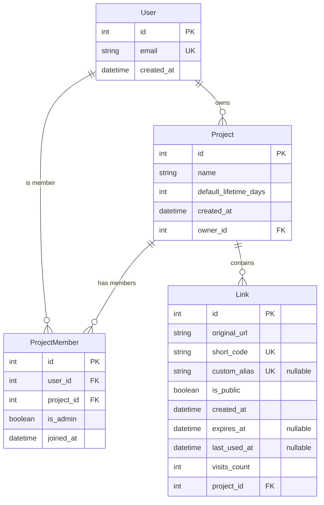

# hse-ai24-python-hw3

# ER Diagram

```mermaid
erDiagram
    User {
        int id PK
        string email UK
        datetime created_at
    }

    Project {
        int id PK
        string name
        int default_lifetime_days
        datetime created_at
        int owner_id FK
    }

    ProjectMember {
        int id PK
        int user_id FK
        int project_id FK
        boolean is_admin
        datetime joined_at
    }

    Link {
        int id PK
        string original_url
        string short_code UK
        string custom_alias UK "nullable"
        boolean is_public
        datetime created_at
        datetime expires_at "nullable"
        datetime last_used_at "nullable"
        int visits_count
        int project_id FK
    }

    User ||--o{ Project : "owns"
    User ||--o{ ProjectMember : "is member"
    Project ||--o{ ProjectMember : "has members"
    Project ||--o{ Link : "contains"
```